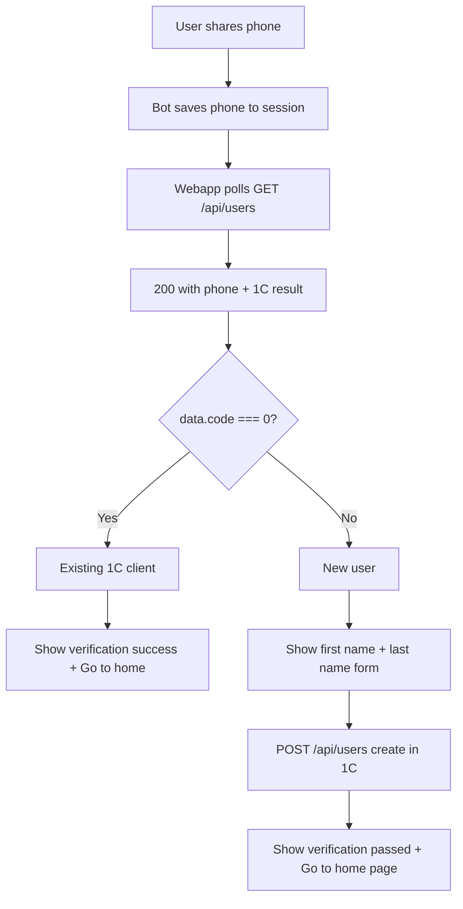

# Verification vs registration flow

## Workflow (user story)

**New user without 1C account:** User starts bot, opens webapp, clicks register, shares phone (shared in background; bot handles it and saves to users in DB). If user not found in 1C, show page asking for first name and last name. User submits; register new user in 1C via API. On success show "You have been successfully verified" and Go home button.

**New user with existing 1C data:** Same share flow; when checking 1C the user is found. Show successfully verified message and Go home button (no form).

**Current state:** [apps/webapp/app/register/page.tsx](apps/webapp/app/register/page.tsx) does not yet implement this: it shows a single form (no share_phone step, no polling, no branch on `code`, no dedicated success screens). Implementation follows the sections below.

---

## Your two cases (technical)

1. **Existing 1C client** – User shares phone; 1C search (by phone) finds them (`code === 0`). This is **verification only**: do not show the first/last name form; show a success screen and a "Go to home" button.
2. **New user** – User shares phone; 1C search finds no user. Show the **registration form** (first name, last name); on submit create the user in 1C, then show "Verification passed successfully" and a "Go to home page" button.

The 1C lookup is already implemented: [apps/bot/src/api.ts](apps/bot/src/api.ts) `searchUserByPhone(phone)` calls the same 1C search endpoint and treats `code === 0` as "user exists". The webapp’s GET [apps/webapp/app/api/users/route.ts](apps/webapp/app/api/users/route.ts) does the same (session phone → 1C search, returns `{ ...data, tgData }` and updates session when `data.code === 0`).

---

## Flow (high level)

---

## Implementation

### 1. Register page: branch after contact is received

**File: [apps/webapp/app/register/page.tsx](apps/webapp/app/register/page.tsx)**

- **State:** Add a third step, e.g. `Step = "share_phone" | "form" | "verification_success" | "registration_success"`. Or reuse two success steps: `verification_success` (existing client) and `registration_success` (new user after form submit).
- **Fetch after contact:** Change the `contactRequested` "sent" handler so it does not only look for a phone string. Keep polling GET `/api/users?userId=...` until you get **200**. The response body is `{ ...data, tgData }` where `data` is the 1C search result (includes `code`). So:
  - When you get 200: read `phone` from `tgData.phone_number` and `code` from `data.code`.
  - If `**data.code === 0`** (user exists in 1C): set step to **verification_success. Do not show the registration form. Optionally call `refreshUserData()` so the app treats them as verified.
  - If `**data.code !== 0`** (or missing): set step to **form and call `goToForm(phone)` as today (first/last name form).
- **Helper:** Replace or extend `fetchPhoneFromSession` so that when polling GET `/api/users` you use the full response (phone + `data.code`) to decide verification vs registration. You can have a small helper that returns `{ phone, code }` or `null` until GET returns 200.

### 2. Verification success screen (existing 1C client)

- When step is **verification_success**, render a screen that:
  - Shows a short message that the account is verified (e.g. "Hisobingiz tasdiqlandi" or similar).
  - Shows a single primary button: **"Bosh sahifaga o'tish"** (or "Go to home") that calls `router.push("/")` and optionally `refreshUserData()`.
- Reuse the same layout/design as other pages (e.g. Header or a simple card with text + button using existing `RippleButton` and `goldButtonClass`).

### 3. Registration success screen (new user, after form submit)

- After a successful POST `/api/users` (and optional referral process), instead of only `toast.success` + `router.push("/")`:
  - Set step to **registration_success**.
  - Render a screen that shows **"Verification passed successfully"** (or the Uzbek equivalent) and a button **"Go to home page"** (e.g. "Bosh sahifaga o'tish") that calls `refreshUserData()` and `router.push("/")`.
- Again reuse the same design system (card, button styles).

### 4. No backend changes required

- GET `/api/users` already returns the 1C search result (`data` with `code`). When `code === 0` it already updates the session with 1C data and `isVerified` ([apps/webapp/app/api/users/route.ts](apps/webapp/app/api/users/route.ts) lines 65–68). No API changes needed.
- POST `/api/users` already creates the user in 1C and updates the session. No changes needed.

---

## Summary

| Case               | After phone shared                                | What to show                                                                                           |
| ------------------ | ------------------------------------------------- | ------------------------------------------------------------------------------------------------------ |
| Existing 1C client | GET /api/users returns 200 with `data.code === 0` | Verification success screen + "Go to home" button                                                      |
| New user           | GET /api/users returns 200 with `data.code !== 0` | First/last name form, then after submit: "Verification passed successfully" + "Go to home page" button |

All logic stays in the register page and uses the existing GET/POST `/api/users` and 1C contract; no changes to [apps/bot/src/api.ts](apps/bot/src/api.ts) or the bot contact handler are required for this flow.
