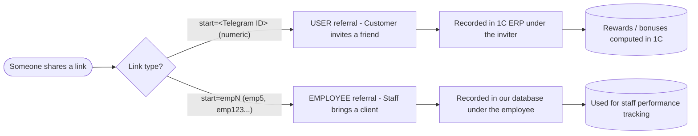
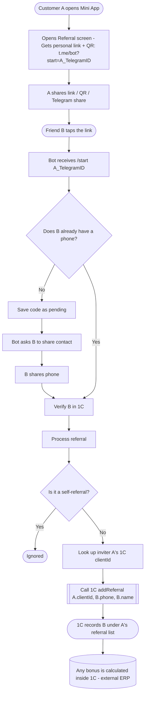
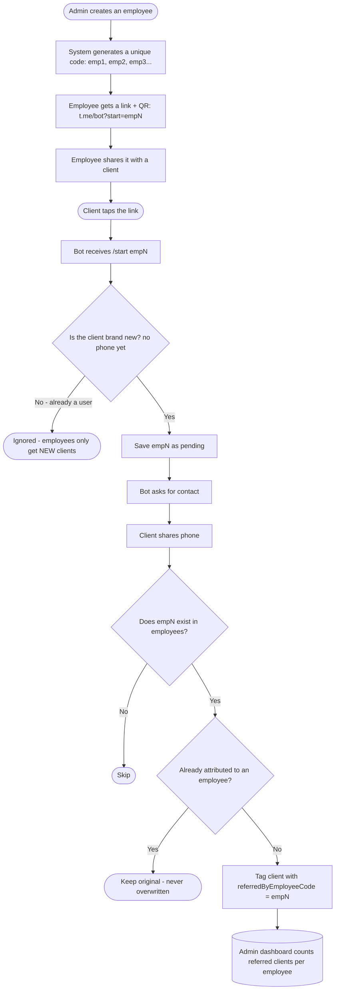

# ASLZAR Referral Program — Workflows

Mermaid source for the referral workflow diagrams. Renders on GitHub, in VS Code (Mermaid preview), or via the bundled `referral-workflow.html`.

## Overview — two referral types

## 1. User referral — customer invites a friend

**Key point:** the friend must verify their phone for the referral to count. The reward is handled by 1C, not the app — the app only displays the referral list and bonus balance pulled from 1C.

## 2. Employee referral — staff brings a client

**Two rules:** (1) An employee referral only applies to a **new** client. (2) Attribution is **permanent** — once set, a later employee link won't change it.

## Side-by-side comparison

| | User referral | Employee referral |
|---|---|---|
| Code format | Numeric Telegram ID | `empN` (emp5...) |
| Who shares | Any customer | Employee / sales staff |
| Applies to | New or existing friend | New clients only |
| Stored where | 1C ERP (external) | Our database (MongoDB) |
| Can change later? | Each event sent to 1C | No — locked once set |
| Purpose | Customer bonuses (via 1C) | Staff performance tracking |
| Requires phone? | Yes | Yes |
